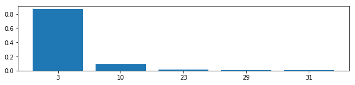
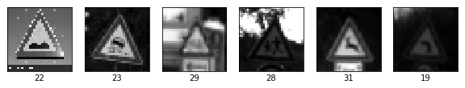
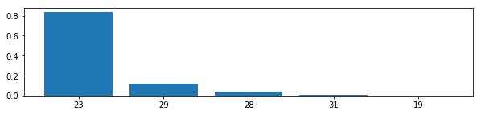

# **Traffic Sign Recognition** 

## Files
This repository consists of following files.
* README.md
    * This file, which explain the whole contents of this project.
* Traffic_Sign_Classifier.ipynb
    * The source code file which processes images, creates model, performs training, and evaluates the accuracy of the model.
* Traffic_Sign_Classifier.html
    * The html file which was saved with the execution result of ipynb source code.
* img_writeup/
    * The folder in which the image files for this write up document are stored.
* web_testdata/
    * The folder in which the image files for model evaluation are stored.

## Writeup

---

**Build a Traffic Sign Recognition Project**

The goals / steps of this project are the following:
* Load the data set (see below for links to the project data set)
* Explore, summarize and visualize the data set
* Design, train and test a model architecture
* Use the model to make predictions on new images
* Analyze the softmax probabilities of the new images
* Summarize the results with a written report

## Rubric Points
### Here I will consider the [rubric points](https://review.udacity.com/#!/rubrics/481/view) individually and describe how I addressed each point in my implementation.  

---
### Data Set Summary & Exploration

It is important to show the overview of dataset. This is because the accuracy of the trained model is largely dependent on the size, uniformity, etc. of the data set.

As a result, the training data set has 34799 samples in 43 classes. If it is uniform, about 809 samples are given as training data for one class.

In practice, however, the number of training samples is different for each class. A data sample for each class is shown in the folowing figure as a bar graph. Therefore, due to lack of training data or excessive learning, the model accuracy may differ between classes.

### Design and Test a Model Architecture

#### 1. Preprocess

In this project, two preprocessing are implemented.

Firstly, a conversion to grayscale is implemented. Although the original images have color of 3 channels, grayscale is sufficient for classification of traffic signs, and I thought that model can be simplified by making channel reduced. Simplicity has the merit of making model tuning more efficient. Original images and grayscaled images are shown in following.

Secondly, a normalization of value is implemented. Original image value is from 0 to 255, processing to normalize from 0 to 1 was implemented. Normalization is important in order to make the model correspond to images in other formats.

#### 2. Final model architecture

My final model consisted of the following layers:

| Layer         		|     Description	        					| 
|:---------------------:|:---------------------------------------------:| 
| Input         		| 32x32x1 Grayscale image   							| 
| Convolution 5x5     	| 1x1 stride, same padding, outputs 28x28x12 	|
| RELU					|												|
| Max pooling	      	| 2x2 stride,  outputs 14x14x24 				|
| Convolution 5x5	    | 1x1 stride, same padding, outputs 10x10x24 	|
| RELU					|												|
| Max pooling	      	| 2x2 stride,  outputs 5x5x24 				|
| Flatten               | outputs 600
| Fully connected		| outputs 400|
| RELU                  | |
| Dropout               | |
| Fully connected		| outputs 100|
| RELU                  | |
| Dropout               | |
| Fully connected		| outputs 43|
| Dropout               | |
| Softmax				| |

Dropout layer are implemented to prevent overfitting.
 
#### 3. How to train

To train the model, I used the method to reduce mean of cross entropy for loss operation. And AdamOptimizer is used for optimization method. Because of newness of it, I judged it to be better. And I set the learning rate to a small value of 0.001 and batch size is 128, based on the size of the dataset and the high computing capacity of the computer. Although it is slow, thought that it can be surely converged. Finally, I set the number of epochs to 100 at the maximum. But if the accuracy gets worse than the results of the last three validations, I ended the training to prevent overfitting.

#### 4. Result and Discussion

My final model results were:
* training set accuracy of 0.998
* validation set accuracy of 0.968
* test set accuracy of 0.950

My aim of this model was to focus on simplicity, to make tuning easier, it succeeded. However, 18 epochs are calculated until the end of the learning. It maybe meke less calculation amount by changing learning rate and optimization method.

### Test a Model on New Images

#### 1. Imeages downloaded from web

Here are five German traffic signs that I found on the web with resized to 32x32 and transformed to grayscale:

These image are distorted due to resizing or inclination, or the margin may be large, so recognition accuracy may be lowered.

#### 2. Result of predictions.

Only two images were recognized correctly, sign id were 3 and 9.
That is, the correct answer rate obtained was 40%.

#### 3. Discussion

Althoug the accuracy of my trained model on the test set divided from prepared dataset was over 90%, the accuracy on the images downloaded from web was only 40%.
However, because the prepared data set was appropriately divided into tarining, validation, and test, it can be considered that it is not just an overlearning problem.
This accuracy reduction is considered to indicate the need for further advanced preprocessing of the input image.

The top 5 softmax outputs in each input are shown below.

Overall, the influence of distortion and margin that I was worried seemed to be great, and the accuracy was greatly reduced than prepared dataset. This would mean that the clipping and resizing, correction of inclination are important procedure.

The three softmax output of incorrect answers is almost exclusive. Especially the result of id = 27 is terrible. It is recognized as a totally different class, and there may be defects in the learning model as well as preprocessing. As one of the factors, image of (id=27) are contained only about 250 samples in the training data set, and data set ununiformity are conceivable.

InputID=3(recognized correctly)

InputID=9(recognized correctly)

InputID=12(recognized incorrectly)

InputID=22(recognized incorrectly)

InputID=227(recognized incorrectly)

